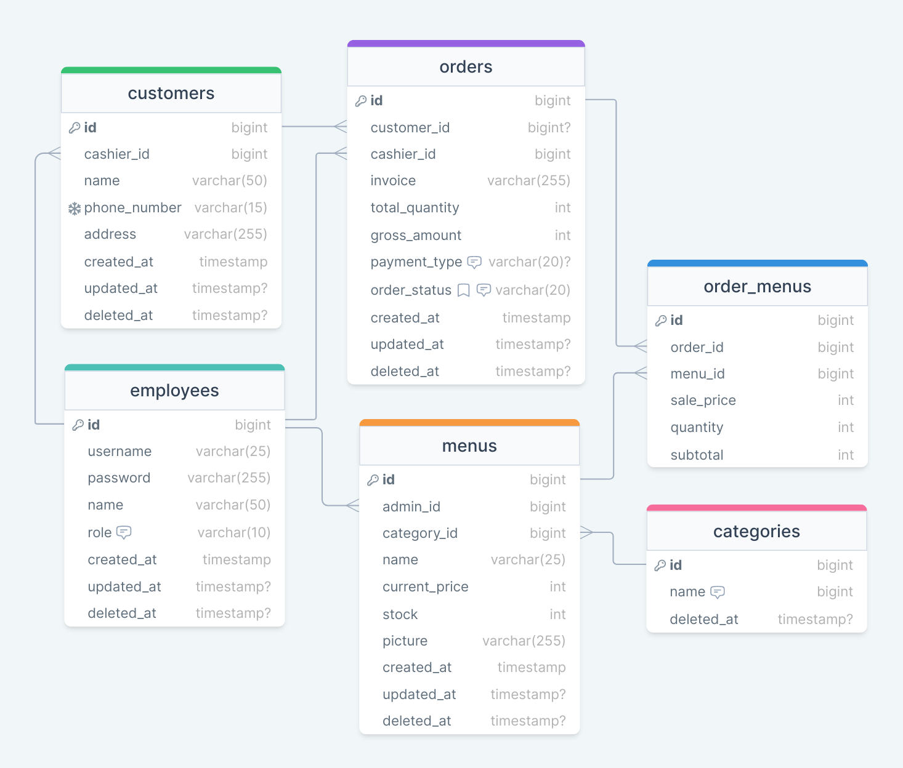

<h1>Deskripsi Teori 1</h1>

<h2>Mvp Tambahan</h2>

1. Cashier dapat menambahkan customer/member.
   Saya menambahkan table customer(member) supaya dapat membantu pemilik toko menganalisa data pelanggan, seperti menu apa yang sering dibeli dan dari mana asalnya. dan pada table orders, foreign key customer_id saya buat nullable karena cashier bisa membuat order tanpa adanya customer(member).

2. Cashier dapat mengelola Order.
   Cashier adalah role yang mempunyai akses untuk membuat, menyelesaikan, dan membatalkan order. Serta menambahkan customer(member).

    1. field payment_type pada table Orders
        - “cash” adalah tipe pembayaran tunai
        - “namabank_transfer” adalah tipe pembayaran melalui bank transfer. contoh bca_transfer.
        - “credit_card”
        - “qris” adalah tipe pembayaran melalui QRIS.
    2. field status pada table Orders
        - “pending” adalah status dimana order baru dibuat dan belum ada action lain.
        - “success” adalah status dimana order sudah diselesaikan. syarat success ini pembayaran sudah dilakukan.
        - “cancel” adalah status dimana order dibatalkan.

3. Admin dapat mengelola Menu.
   Admin adalah role yang mempunyai akses untuk mencetak atau menampilkan data laporan. Serta mengelola menu.

4. Pada aplikasi semua role bisa nemabahkan Category.

\*nb: saya menambahkan sale price di table order_menus karena ketika price di table menu berubah, maka price di table orders tidak akan ikut berubah.

<h2>Tech Stack</h2>

1. Golang: untuk membangun web service ini saya akan memilih bahasa pemograman Golang.
2. Echo: Karena belum mencoba framework lain jadi saya memilih echo. Saya pernah baca kalau secara performa echo masih diatas gin dan dibawah fiber, karena fiber menggunakan fast/http.
3. MySQL: MySQL sudah cukup untuk aplikasi web service sederhana ini.
4. GORM: memilih gorm karena orm ini adalah yang paling banyak digunakan sertia menggunakan orm dapat mempermundah melakukan query ke database.
5. Midtrans: menggunakan midtrans sebagai payment gateway untuk pembayaran melalui transfer, credit card, ataupun qris.
6. Cloudinary: digunakan untuk menyimpan gambar makanan atau minuman. sebenarnya bisa menggunakan aws, tapi saya tidak tahu untuk production lebih murah yang mana.
7. CI/CD: Gihub Action, Docker, dan AWS.

